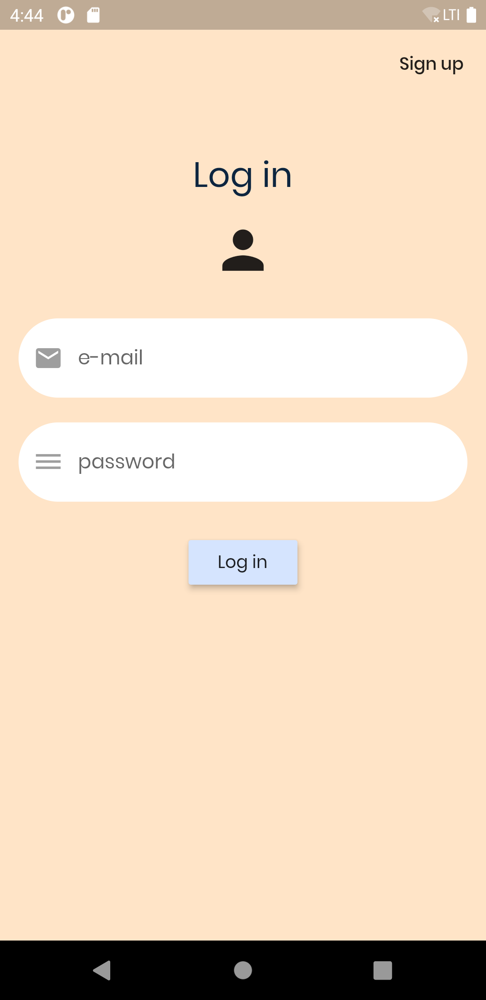
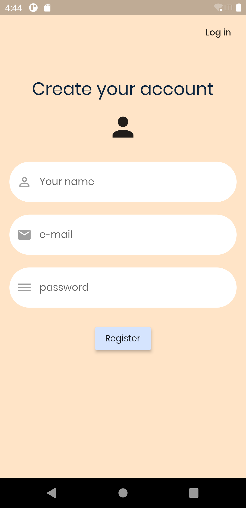
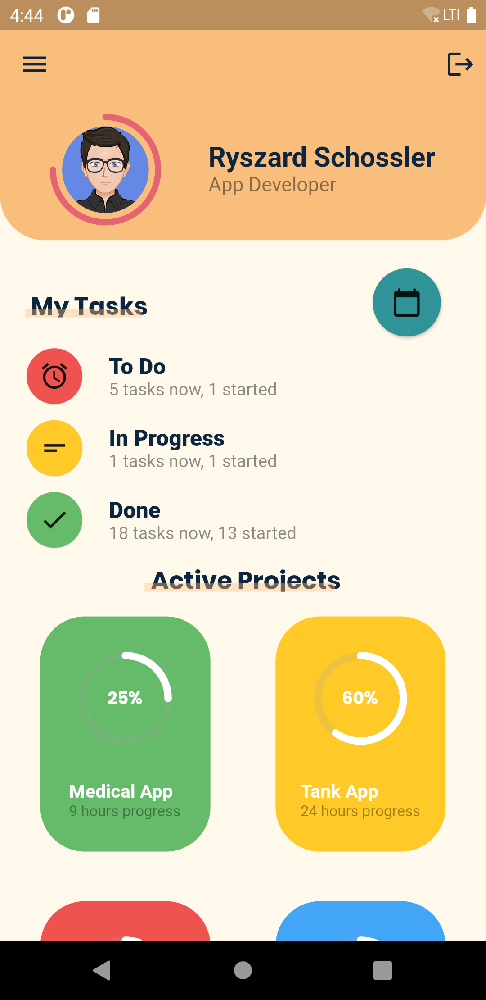
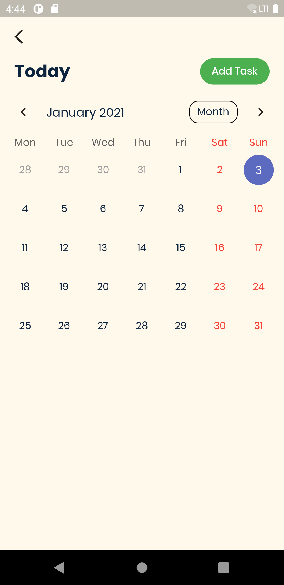

# task_planner

This App is built in Flutter. App UI is based on [Task Planner App](https://dribbble.com/shots/10951333/attachments/2566966?mode=media) made by [Purrweb UI](https://dribbble.com/purrwebui). Most of the app is static. Log in and register is dynamic it means that flutter frontend is connected to firebase.

# Screenshots of an App.

